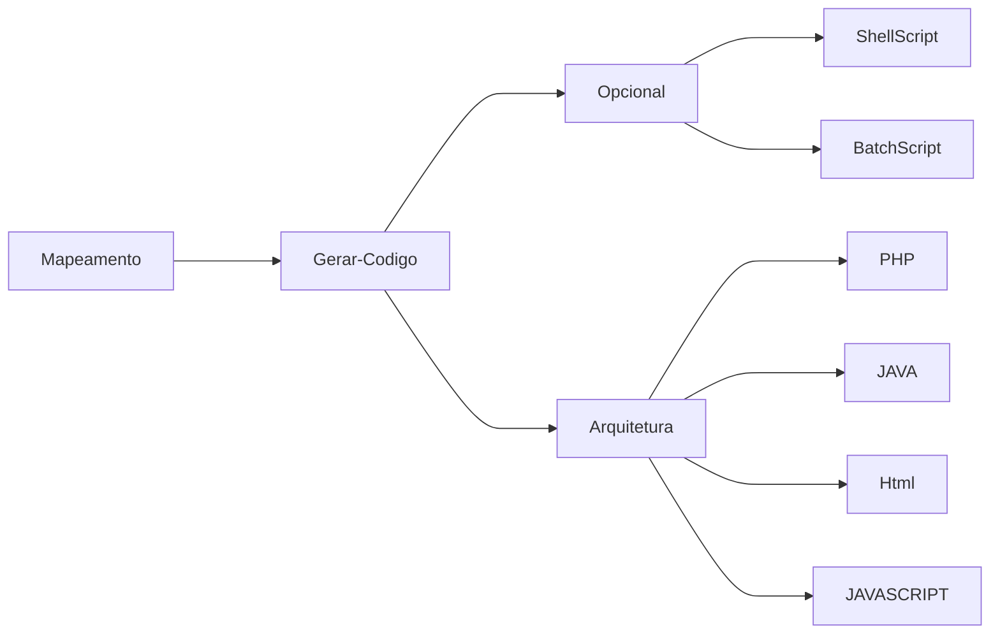

# MapperIdea-PHP
## Introdução ao Mapperidea 

Aqui esta alguns exercícios do MapperIdea, através das dicas aqui faladas é possível desenvolver sua primeira aplicação de agile code

### Mapperidea
__Finalidade da Ferramenta :__
Agilizar o desenvolvimento de Software com mapas mentais, possibilitando reaproveitamento de código através da arquitetura modelada pelo Desenvolvedor / Analista.
*Ideia : "Criar na unha  apenas uma vez"*


#### Pré-Requisitos Linguagens de programação

-  Linguagem Javascript (Vanilla JS) #JAVASCRIPT ;
-  As linguagens de marcação e estilo #HTML E #CSS ;
-  SpringBoot para o back-End  #JAVA #SPRINGBOOT 
-  Ou Node JS #NODJS

#### Principais conceitos MaperIDea
- O [[XML]]    é de extrema importância pois os documentos gerados pela Estrutura gerada são em mm que é um tipo de arquivo  Em sua base XML.
- O [[XPATH - Básico|Xpath]] é essência para utilização do MI (MapperIdea) , através dele é possível correr os documentos XML. 
- O conceito de [[XQUERY]] facilita o entendimento da aplicação das funções dentro de Mapperidea.

### SOFTWARES UTILIZADOS 
- NODE 12 
- Freemind 1.0 + pacote de icones 

> O mapeamento é um processo em que os membros da equipe de desenvolvimento podem executar, envolve "copiar" o codigo traduzindo-o em mapas mentais, 
> os quais poderão se alterados atualizados uma vez montados, sem necessidade de alterar código "na unha".

Após efetuar os mapeamentos, é necessário executar via linha de comando a geração de códigos, que é uma conversão do codigo mapeado em codigos práticos.


### INSTALAÇÃO E USO DA FERRAMENTA

- Instalar antes o node versão 12 

```npm install mapperidea-cli -g ```

- teste usando o comando 

``` mi -h ```

 - Na sequência utilize  com os dados fornecidos pela Mapperidea para autorizar seus acessos.
 authorize|a <email> <machine> <server>

- inicialize o projeto com o nome do projeto e o nome do arquivo
``` mi init <nome do projeto> <arquivo.mm> ```

- Atualize o projeto subindo as informações para o servidor
``` mi push <nome do projeto> ```

### CRIAÇÃO DO ARQUIVO

